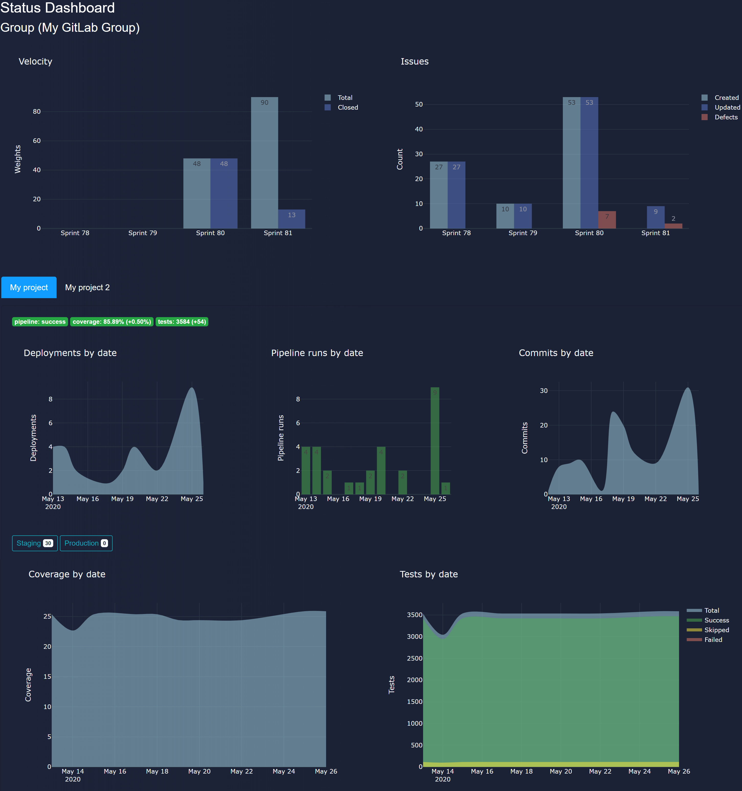

# Status (GitLab) Dashboard


The dashboard is intended to simplify the presentation of the evolution of products and projects for different stakeholders. 

It uses GitLab APIs and is based on Python with Plotly Dash.

Tested with:

- Python 3.7.3
- Dash 1.12.0
- GitLab 13+



## Environment

| Key | Description | Default |
|:-------------------|:------------|:--------|
| GITLAB_TOKEN       | GitLab token will be used whenever the API is invoked | |
| GITLAB_GROUP_ID    | GitLab group id | |
| GITLAB_PROJECT_IDS | GitLab project id list (Json format) | see `.env.example` for details |
| FLASK_ENV          | Setting FLASK_ENV to `development` will enable debug mode | production |
| DEBUG              | Debug mode (optional) | false |
| LOGLEVEL           | Logging level (optional) | INFO |
| LOGFORMAT          | Logging format output (optional) | %(asctime)s - %(levelname)s - %(message)s |
| APP_NAME           | Dashboard application name (optional) | GitLab Dashboard |
| APP_HOST           | Dashboard host ip adress (optional) | 0.0.0.0 (for Docker environment) |
| APP_PORT           | Dashboard port (optional) | 8080 |

Rename your `.env.example` to `.env` and add the required changes.

## Run locally

```bash
$ pip install -r requirements.txt
```

## Run via Docker

```bash
$ docker run --rm --env-file .env --name status-dashboard -p 8080:8080 juergenpointinger/status-dashboard:latest
```

## Build via Docker

```bash
$ docker build . -t juergenpointinger/status-dashboard:latest
$ docker run --rm --name status-dashboard -p 8080:8080 juergenpointinger/status-dashboard:latest
```